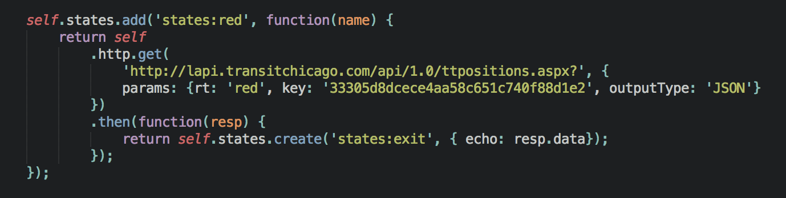

Add an HTTP request
===================

In this section we will show you how to add an http request to your sandbox application.

As an example, we are going to preform a GET request to `CTA train tracker <http://lapi.transitchicago.com/api/1.0/ttpositions.aspx?key=33305d8dcece4aa58c651c740f88d1e2&rt=red&outputType=JSON>`_. which returns a total number of in-service trains for Red line.

Read more about HTTP API `here <http://vumi-jssandbox-toolkit.readthedocs.io/en/latest/http_api.html>`_.
