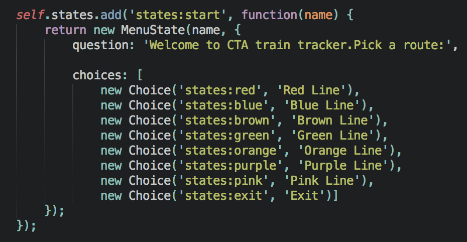
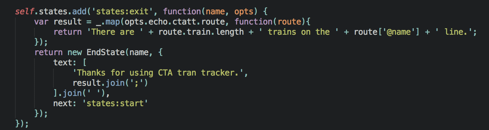

Creating states
===============

States are the building blocks of sandbox applications. In this section we will learn how to create states using `CTA train tracker <https://github.com/praekelt/go-jsbox-http-request-example>`_ sandbox application.

Overview of States
------------------

The states that we used for this sandbox appication are:

- StartState
- ChoiceState
- MenuState
- EndState

StartState
----------

A state when the user starts a session on the USSD. The following is an example of a StartState:

The example above also uses **ChoiceState** and **MenuState** which displays a list of numbered choices and allows a user to respond by selecting one of the choices. E.g Red line, Blue line, Brown line etc.

EndState
--------
This displays text and then terminates a session when the user is on the exit state. The following is an example of a EndState:

Read more about States `here <http://vumi-jssandbox-toolkit.readthedocs.io/en/latest/states/index.html>`_.
