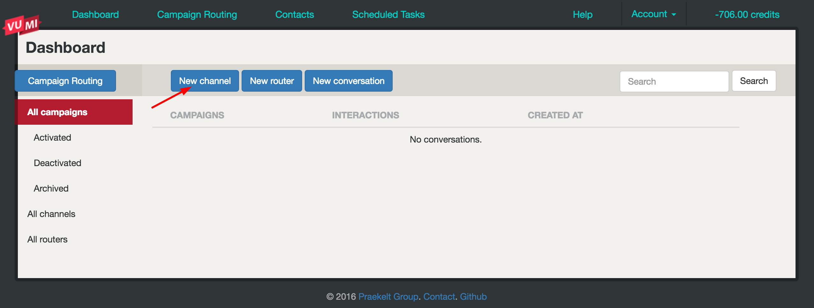
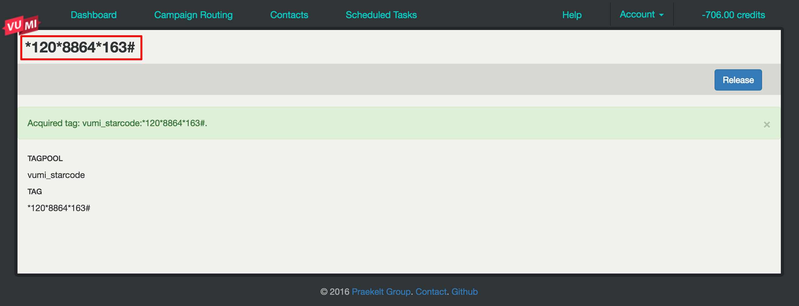
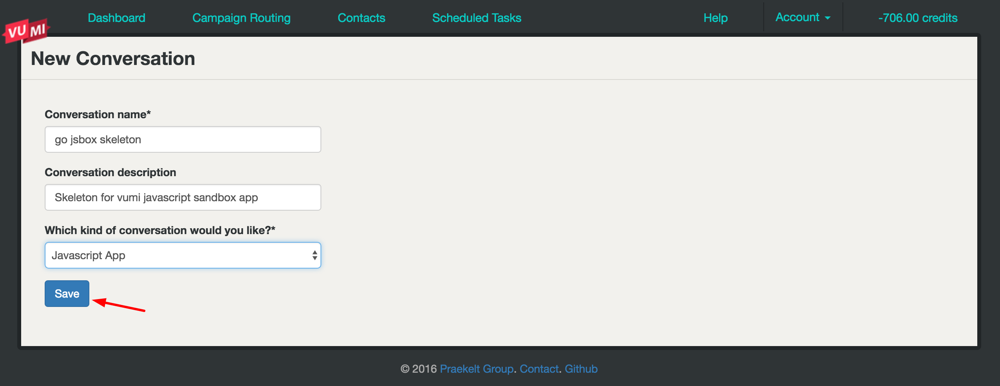
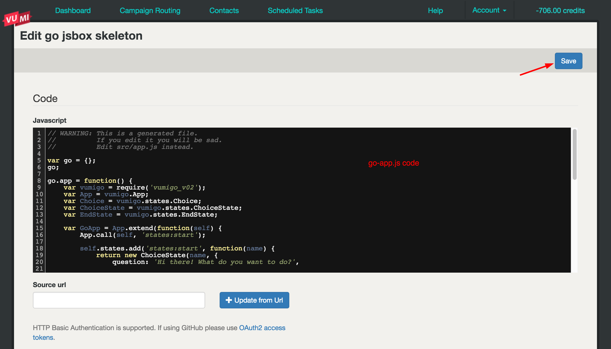
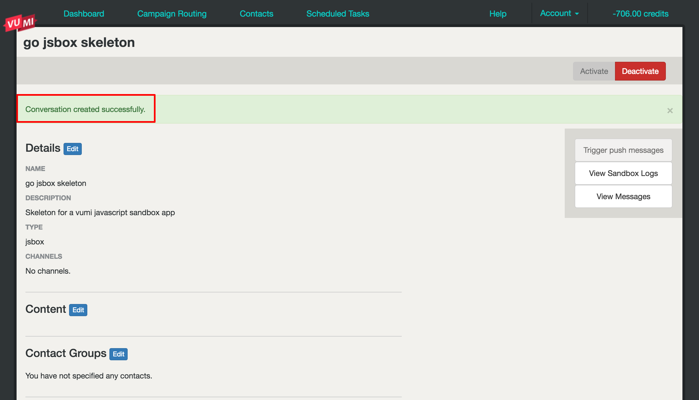

Deploying to VumiGo and Standalone
==================================

In this part of the tutorial, we will learn how to deploy our app to `VumiGo <https://go.vumi.org>`_ and standalone using our sandbox skeleton app example.

Deploying to VumiGo
-------------------

**1. Set up a VumiGo account**

You will need a VumiGo account to deploy our sandbox skeleton app. If you already have a VumiGo account please move on to Step 2.

- To set up a VumiGo account please contact the vumi development team via email by joining the the `vumi-dev@googlegroups.com <https://groups.google.com/forum/?fromgroups#!forum/vumi-dev>`_ mailing list or on irc in #vumi on the `Freenode IRC network <https://webchat.freenode.net/?channels=#vumi>`_.

**2. Sign in VumiGo**

To sign in to VumiGo account, do the following: 

- Go to https://go.vumi.org/accounts/login/?next=/conversations/
- Enter your email address and password
- Click Sign in

After you have signed in, your dashboard panel should look like this:

.. figure::  images/dashboard.png

**3. Create a new channel**

To create a new channel follow the following steps:

- Click new channel

- Select a **destination** and a **channel** as is shown in the picture below. Click **save**.

.. figure::  images/save_new_channel.png

By clicking **save**, you will be taken to the page shown below where you will see your new generated **USSD** code. Click **dashboard**.

.. warning::

   Don't click the release button!

**4. Create new conversation**

To create a new conversation the steps are as follows:

- Click new conversation

- Enter a new **conversation name** and **conversation description** and then select a **kind of conversation** of your choice. Please see the picture below. Click **save**.

- Now copy the code in `go-app.js <https://github.com/praekelt/go-jsbox-skeleton/blob/develop/go-app.js>`_ file and paste it here:

After clicking **save**. You have successfully created a new conversation. Click **dashboard**.

**5. Campaign routing**
