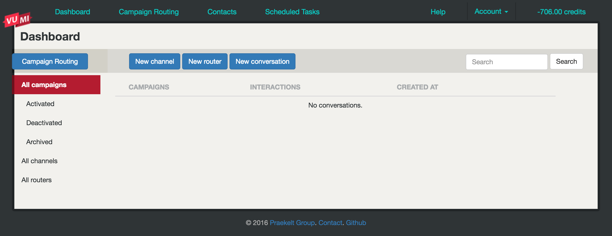

Deploying to VumiGo and Standalone
==================================

In this part of the tutorial, we will learn how to deploy our app to `VumiGo <https://go.vumi.org>`_ and standalone using our sandbox skeleton app example.

Deploying to VumiGo
-------------------

**1. Set up a VumiGo account**

You will need a VumiGo account to deploy our sandbox skeleton app. If you already have a VumiGo account please move on to Step 2.

- To set up a VumiGo account please contact the vumi development team via email by joining the the `vumi-dev@googlegroups.com <https://groups.google.com/forum/?fromgroups#!forum/vumi-dev>`_ mailing list or on irc in #vumi on the `Freenode IRC network <https://webchat.freenode.net/?channels=#vumi>`_.

**2. Sign in VumiGo**

To sign in to VumiGo account, do the folliwing: 

- Go to https://go.vumi.org/accounts/login/?next=/conversations/
- Enter your email address and password
- Click Sign in

After you have signed in you should see:

