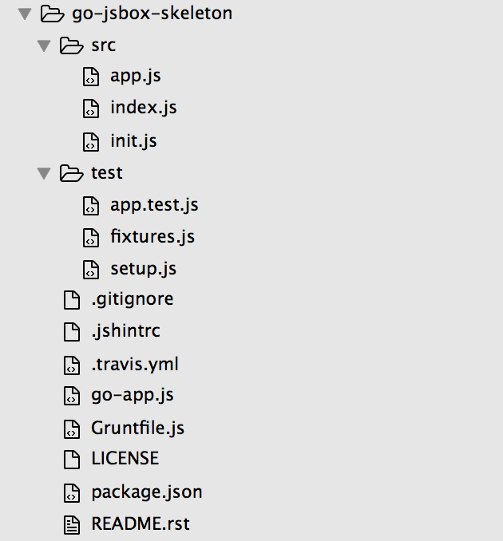

Sandbox skeleton
================

In this section, We'll learn how to use the `sandbox skeleton <https://github.com/praekelt/go-jsbox-skeleton>`_. Use this skeleton as a starting point for writing a sandbox application.

Requirements:
-------------

You will need the following things properly installed on your computer.

- `nodejs <https://nodejs.org/en/>`_
- `npm <https://docs.npmjs.com/>`_
- `gruntjs <http://gruntjs.com/>`_ 

Getting Started
---------------

Find the `sandbox skeleton <https://github.com/praekelt/go-jsbox-skeleton>`_ repo.

Clone the repo::

	$ git clone https://github.com/praekelt/go-jsbox-skeleton
	$ cd go-jsbox-skeleton

Install requirements::

    $ npm Install

Run tests::

    $ npm test

Sandbox skeleton directory structure
------------------------------------

After you've cloned the repo and installed all the requirements, the sandbox skeleton directory should look like this:

Now let's take a look at the folders and files inside our go-jsbox-skeleton app directory.

**src:** Is the folder where the project's source files are stored or located.
	- **app.js:** The majority of the go-jsbox-skeleton app code happens in this file.  
	- **index.js:** / **init.js:** There's no need to worry about this files they contain `boilerplate code <https://en.wikipedia.org/wiki/Boilerplate_code>`_.

**test:**
	- **app.test.js:** This file contains go-jsbox-skeleton app test configuration.
	- **fixture.js:** This file contains a list of fixtures. If you look at the code inside the file you'll notice that it pretends to be a server if the app makes an http request. it basically telling what an http should expect and respond to those requests.
	- **setup.js:** Again, this file contains a `boilerplate code <https://en.wikipedia.org/wiki/Boilerplate_code>`_. There's nothing to worry about. 

**travis.yml:** Is the configuration file for Travis-CI. Runs all go-jsbox-skeleton app tests everytime we commit or to GitHub. Read more about Travis-CI `here <https://travis-ci.org/>`_.

**go-app.js:** This is a generated file. It a compiled version of go-jsbox-skeleton app. It auto generated when you run ``npm test``.

.. warning::

	Don't edit this file (go-app.js). Edit src/app.js instead!

**gruntfile.js:** This file contains grunt configuration such as grunt plugins (``grunt-contrib-jshint``, ``grunt-mocha-test``, ``grunt-contrib-concat``, ``grunt-contrib-watch``) and other grunt packages that we need for our project(``go-jsbox-skeleton``).

**package.json:** Contains a list of npm dependencies to install for go-jsbox-skeleton app by running ``npm install``.
