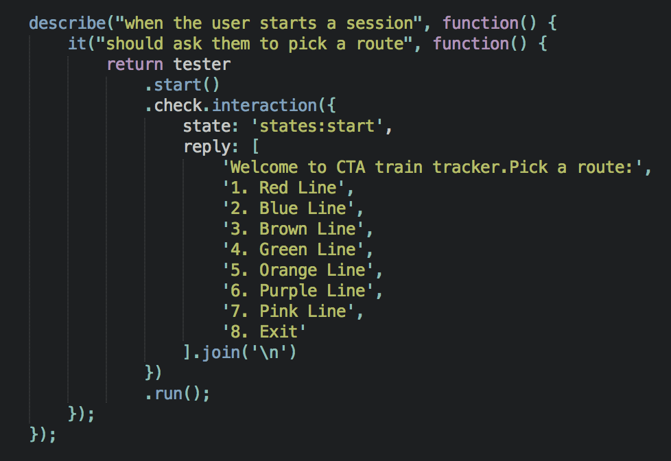
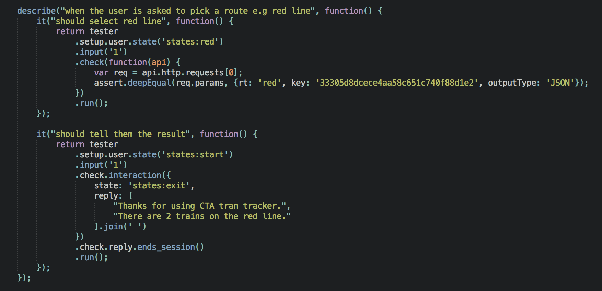

Updating tests
==============

The picture shown below is a test example when the user starts a session and asked to pick a route.

In the following example we want to check that the response was given to http://lapi.transitchicago.com/api/1.0/ttpositions.aspx?key=33305d8dcece4aa58c651c740f88d1e2&rt=red&outputType=JSON and check the the request's data equals the content given by the user.

To run the tests type: npm test

Read more about Test Utilities `here <http://vumi-jssandbox-toolkit.readthedocs.io/en/master/test_utils.html>`_.
